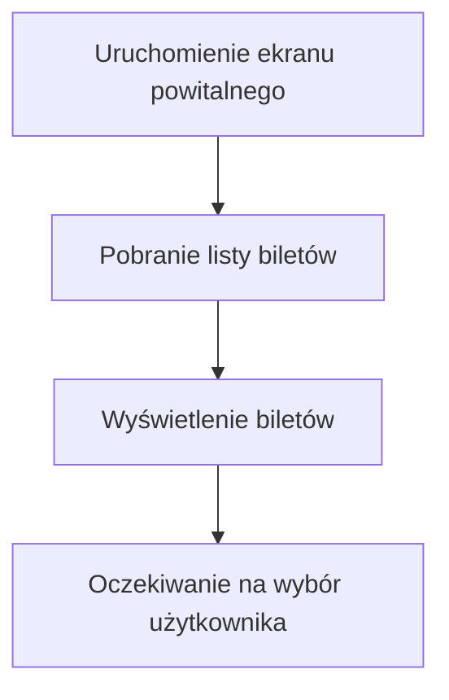
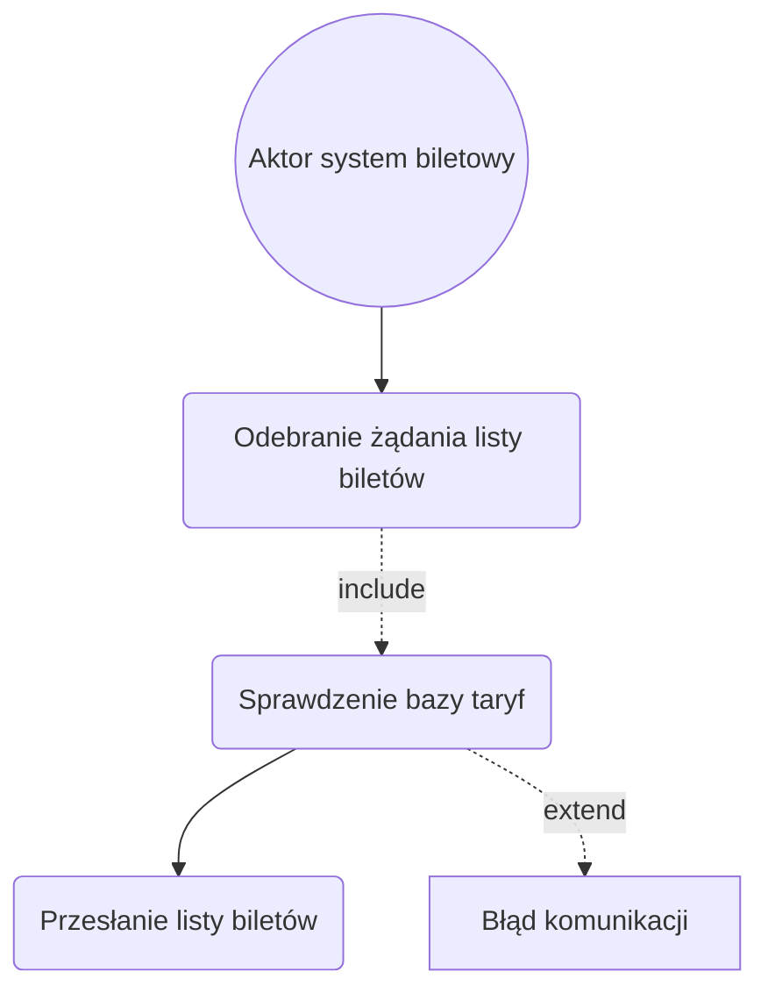
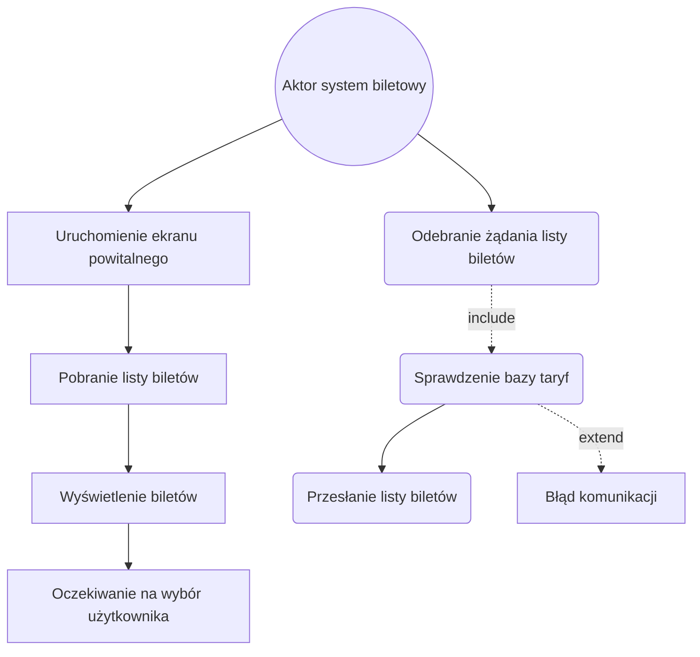
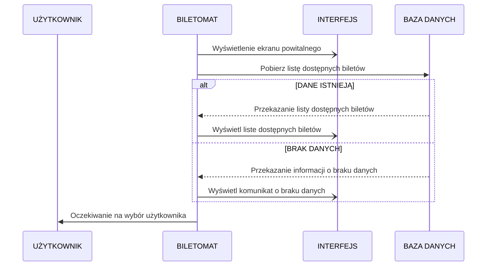
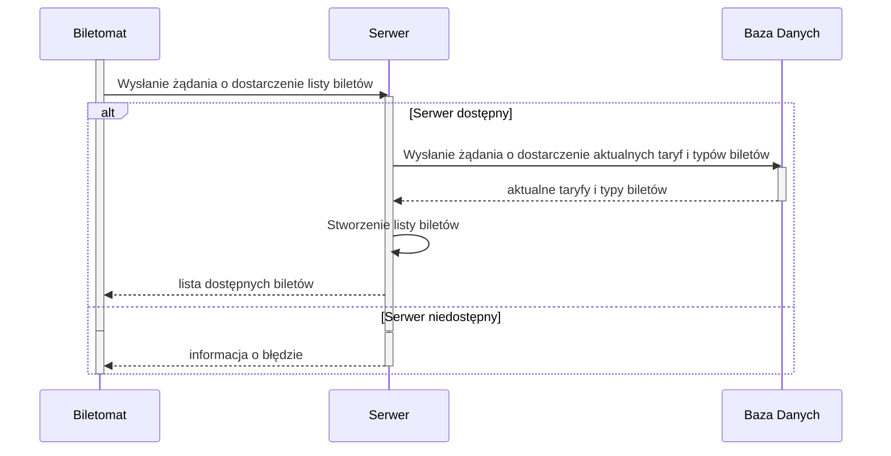
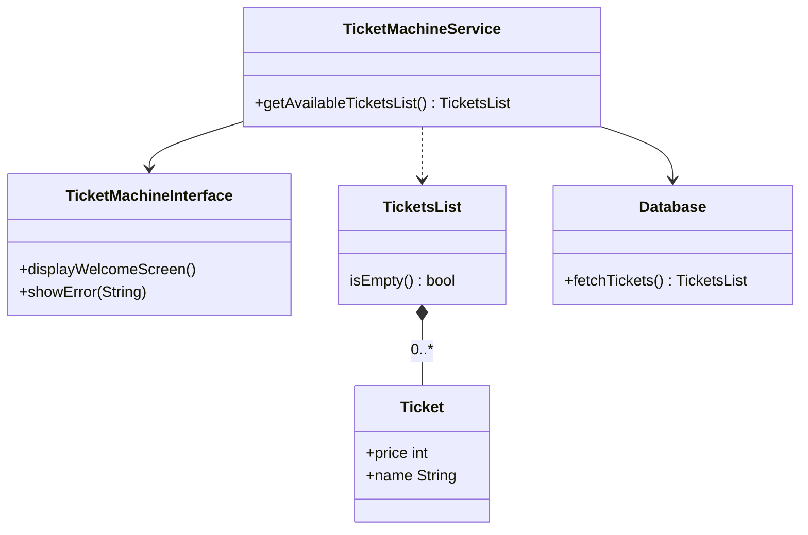
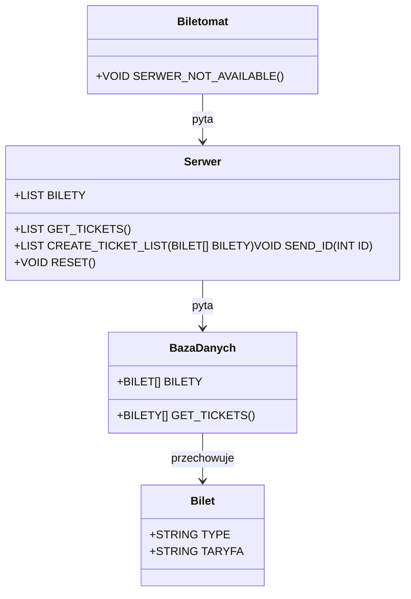

1. Jako system biletowy, chcę rejestrować każde sprzedane bilety, aby śledzić
ruch i sprzedaż w systemie.
2. Jako system biletowy, chcę współpracować z aplikacjami mobilnymi, aby
użytkownik mógł uzyskać elektroniczny bilet w przypadku takiego wyboru.
3. Jako system biletowy, chcę dostarczać aktualne dane o taryfach i typach 
biletów do biletomatu, aby użytkownik miał zawsze poprawne informacje.
4. Jako system biletowy, chcę umożliwiać sprawdzenie ważności biletu w czasie 
rzeczywistym, aby zapobiegać oszustwom.

## Diagramy przypadków użycia
### Wyświetlenie dostępnych biletów

1. Użytkownik wybiera metodę płatności (karta, gotówka, telefon) (Wybór metody płatności).
2. System weryfikuje dostępność wybranej metody (Weryfikacja metody płatności).
3. Użytkownik dokonuje płatności (np. wprowadza kartę, gotówkę, korzysta z NFC) (Realizacja płatności).
4. System potwierdza zakończenie transakcji (Potwierdzenie transakcji).
5. Użytkownik w dowolnym momencie może anulować proces (Anulowanie transakcji).

#### Wizualizacja

### Dostarczanie listy biletów do biletomatu
1. System biletowy odbiera żądanie od biletomatu dotyczące listy biletów 
(Odebranie żądania listy biletów).
2. System biletowy sprawdza aktualne taryfy i typy biletów w bazie danych 
(Sprawdzenie bazy taryf).
3. System biletowy przesyła listę dostępnych biletów do biletomatu (Przesłanie 
listy biletów).
Relacje:

• Include: Sprawdzenie bazy taryf (Weryfikacja taryf).

• Extend: Obsługa błędów komunikacji (np. brak połączenia z biletomatem) (Błąd 
komunikacji).

#### Wizualizacja

## Wspólny diagram przypadków użycia

## DIAGRAMY SEKWENCJI
### Wyświetlenie dostępnych biletów
AKTOR: UŻYTKOWNIK
OBIEKTY: BILETOMAT, INTERFEJS, BAZA DANYCH
KOLEJNOSC KOMUNIKATÓW: 
1. BILETOMAT WYŚWIETLA EKRAN POWITALNY NA INTERFEJSIE
2. BILETOMAT WYSYŁA ZAPYTANIE DO BAZY DANYCH O LISTĘ DOSTĘPNYCH BILETÓW
3. BAZA DANYCH ODPOWIADA PRZESYŁAJĄC LISTĘ DOSTĘPNYCH BILETÓW
4. BILETOMAT PREKAZUJE DANE DO INTERFEJSU ABY WYŚWIETLIŁ KATEGORIĘ BILETÓW I ICH SZCZEGÓŁY
5. BILETOMAT CZEKA NA WYBÓR UŻYTKOWNIKA

SCENARIUSZ ALTERNATYWNY 1 ( BRAK DANYCH ):
1. BILETOMAT URUCHAMIA INTERFEJS EKRANU POWITALNEGO
2. BILETOMAT WYSYŁA ZAPYTANIE DO BAZY DANYCH O LISTĘ DOSTĘPNYCH BILETÓW
3. BAZA DANYCH ODPOWIADA ŻE JEST BRAK DANYCH
4. BILETOMAT WYŚWIETLA NA INTERFEJSIE KOMUNIKAT O BRAKU DANYCH
5. BILETOMAT CZEKA NA WYBÓR UŻYTKOWNIKA

### WIZUALIZACJA DIAGRAMU SEKWENCJI

## Diagram sekwencji "Dostarczenie listy biletów do biletomatu"

## Diagramy klas

### "Wyświetlenie dostępnych biletów"

### "Dostarczenie listy biletów do biletomatu"
#### OPIS KLAS
#### KLASY
##### Biletomat
 - METODY: `VOID SERWER_NOT_AVAILABLE()`
##### Serwer
 - ATRYBUTY: `LIST<BILET> BILETY`
 - METODY: `LIST<BILET> GET_TICKETS()`, `LIST<BILET> CREATE_TICKET_LIST(BILET[] BILETY)`
##### BazaDanych
 - ATRYBUTY: `BILET[] BILETY`
 - METODY: `BILETY[] GET_TICKETS()`
##### Bilet
 - ATRYBUTY: `STRING TYPE`, `STRING TARYFA`
#### WIZUALIZACJA

