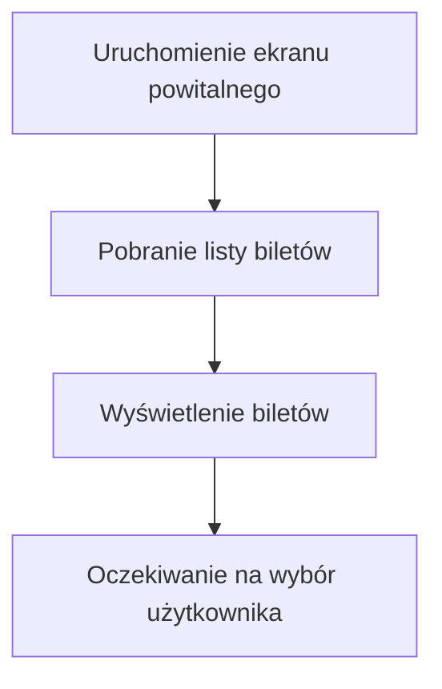

1. Jako system biletowy, chcę rejestrować każde sprzedane bilety, aby śledzić
ruch i sprzedaż w systemie.
2. Jako system biletowy, chcę współpracować z aplikacjami mobilnymi, aby
użytkownik mógł uzyskać elektroniczny bilet w przypadku takiego wyboru.
3. Jako system biletowy, chcę dostarczać aktualne dane o taryfach i typach 
biletów do biletomatu, aby użytkownik miał zawsze poprawne informacje.
4. Jako system biletowy, chcę umożliwiać sprawdzenie ważności biletu w czasie 
rzeczywistym, aby zapobiegać oszustwom.

## Diagramy przypadków użycia
### Wyświetlenie dostępnych biletów

1. Użytkownik wybiera metodę płatności (karta, gotówka, telefon) (Wybór metody płatności).
2. System weryfikuje dostępność wybranej metody (Weryfikacja metody płatności).
3. Użytkownik dokonuje płatności (np. wprowadza kartę, gotówkę, korzysta z NFC) (Realizacja płatności).
4. System potwierdza zakończenie transakcji (Potwierdzenie transakcji).
5. Użytkownik w dowolnym momencie może anulować proces (Anulowanie transakcji).

#### Wizualizacja

