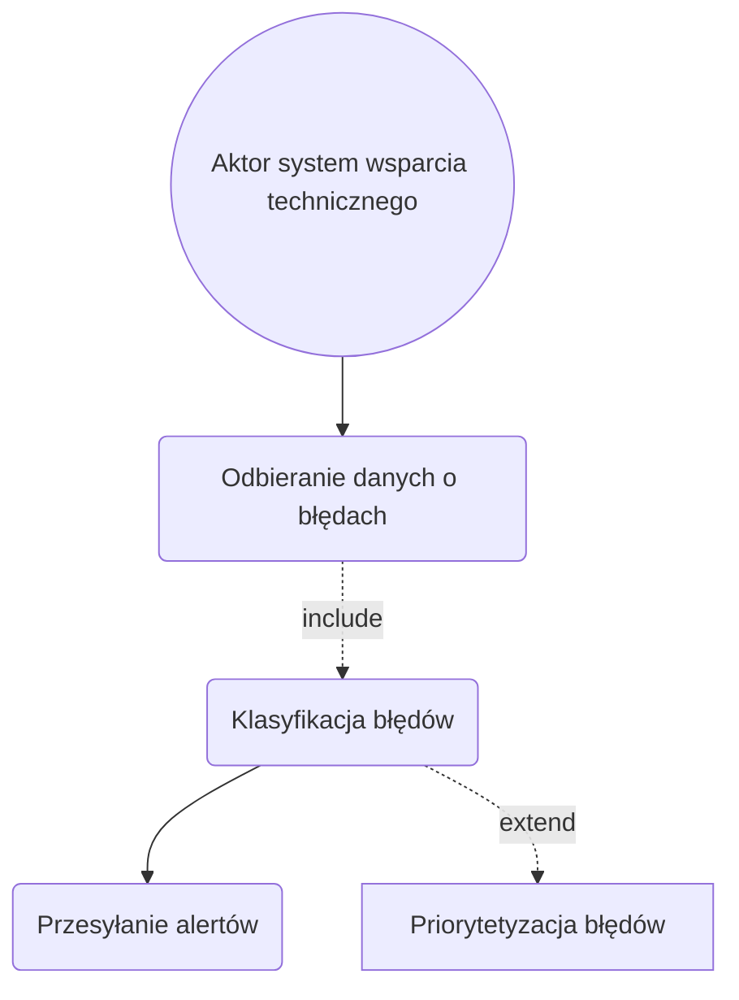

1. Jako system wsparcia technicznego, chcę automatycznie monitorować stan
biletomatów (np. brak papieru, awaria terminala), aby reagować na problemy w
krótkim czasie.
2. Jako system wsparcia technicznego, chcę wysyłać alerty o błędach i
anomaliach do serwisu, aby uniknąć przestojów w działaniu urządzenia.
3. Jako system wsparcia technicznego, chcę automatycznie monitorować stan 
biletomatów (np. brak papieru, awaria terminala), aby reagować na problemy w 
krótkim czasie.
4. Jako system wsparcia technicznego, chcę wysyłać alerty o błędach i 
anomaliach do serwisu, aby uniknąć przestojów w działaniu urządzenia.

## DIAGRAMY PRZYPADKÓW UŻYCIA
### Wysyłanie alertów o błędach
Opis krokowy:
1. System wsparcia technicznego odbiera dane o błędach i anomaliach z 
biletomatów (Odbieranie danych o błędach).
2. System wsparcia technicznego klasyfikuje błędy według poziomu krytyczności 
(Klasyfikacja błędów).
3. System wsparcia technicznego przesyła alerty do zespołów odpowiedzialnych za 
obsługę techniczną (Przesyłanie alertów).
Relacje:

• Include: Klasyfikacja błędów i anomalii (Klasyfikacja błędów).

• Extend: Priorytetyzacja błędów według lokalizacji i czasu ostatniej konserwacji 
(Priorytetyzacja błędów)

#### Wizualizacja

