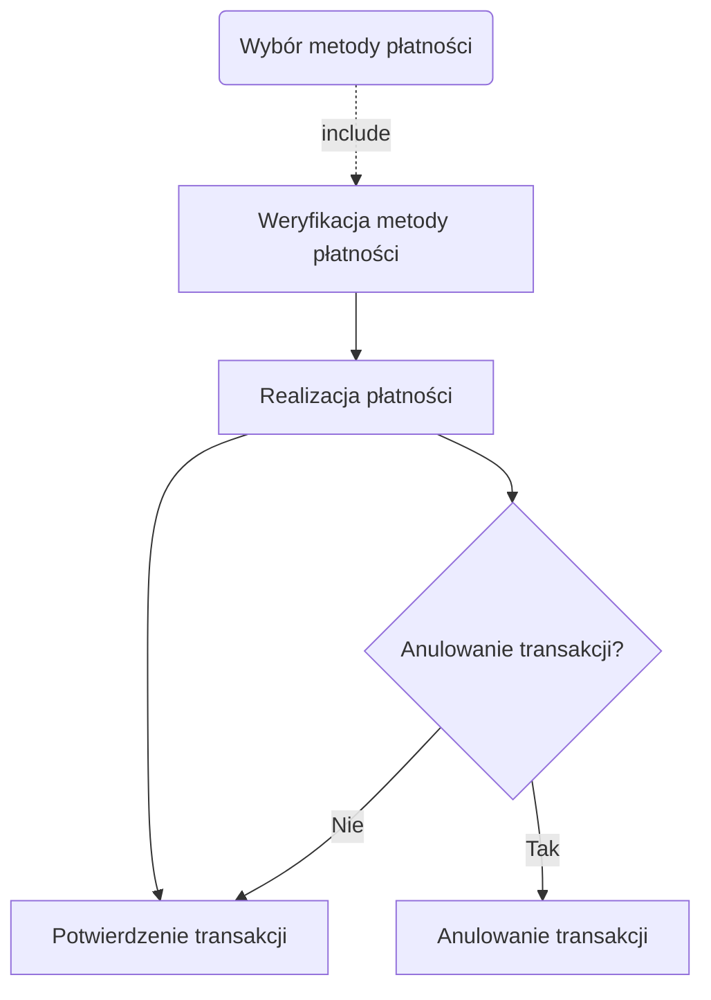
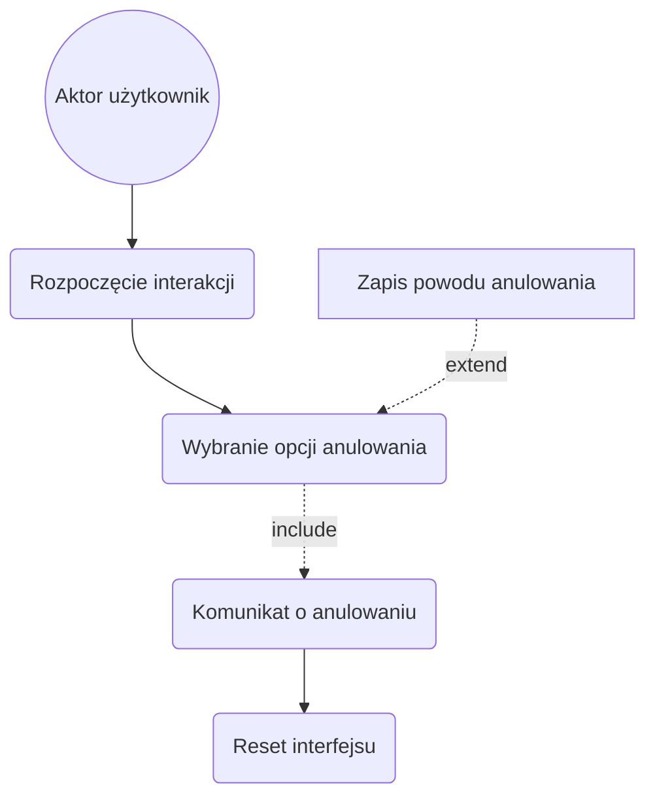
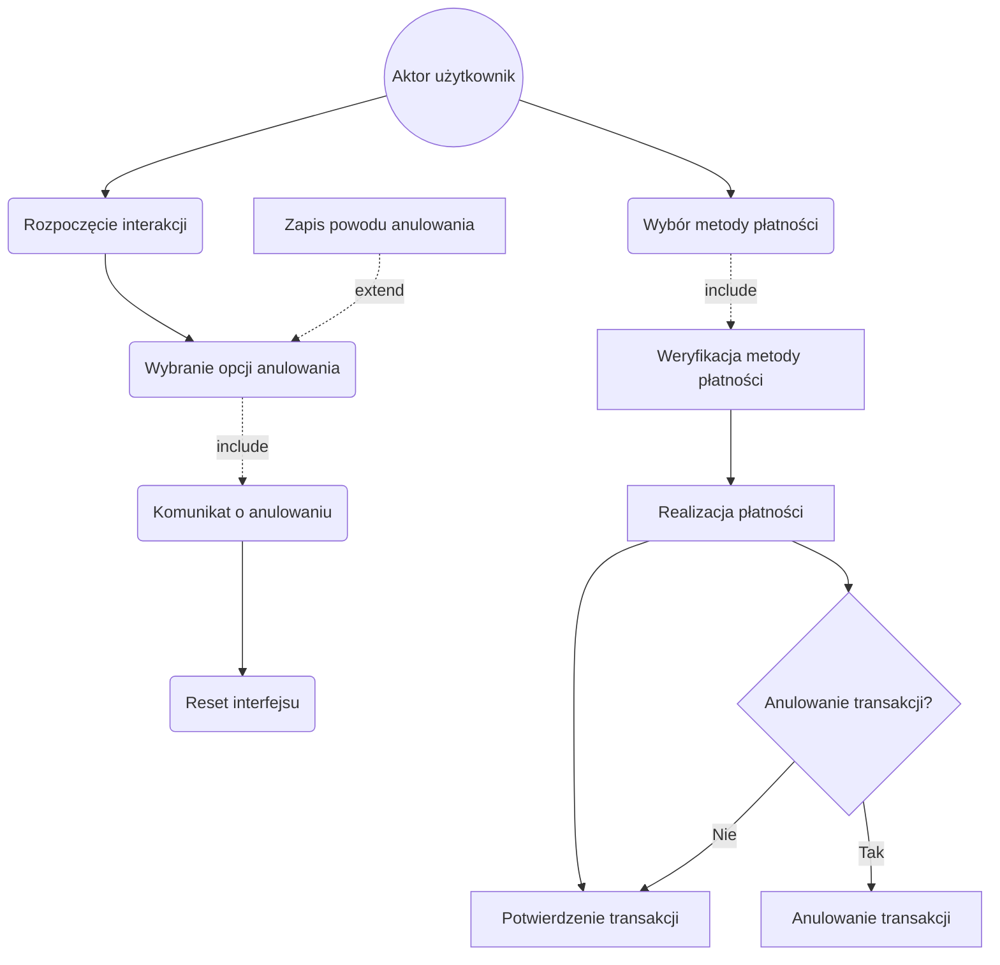
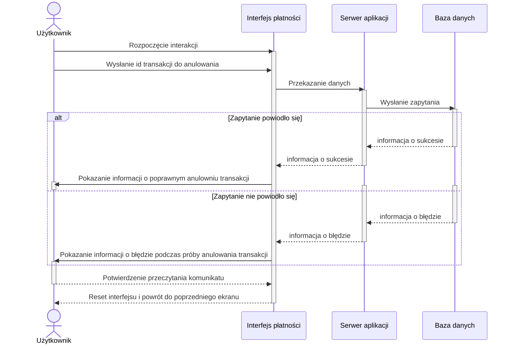

1. Jako użytkownik, chcę płacić za bilet kartą, gotówką lub telefonem, aby mieć
większą elastyczność w wyborze metody płatności.
2. Jako użytkownik, chcę otrzymać wyraźne instrukcje na ekranie, aby wiedzieć,
jak dokonać zakupu krok po kroku.
3. Jako użytkownik, chcę widzieć czas pozostały na decyzję (np. wyświetlany
licznik czasu), aby móc szybko podjąć działanie.
4. Jako użytkownik, chcę szybko wybrać rodzaj biletu, aby zminimalizować czas 
spędzony przy biletomacie.
5. Jako użytkownik, chcę mieć możliwość wyboru języka, aby móc korzystać z 
biletomatu bez względu na znajomość języka lokalnego.
6. Jako użytkownik, chcę sprawdzić poprawność transakcji przed jej finalizacją, 
aby uniknąć pomyłek.
7. Jako użytkownik, chcę otrzymać potwierdzenie zakupu (np. wydruk biletu lub 
elektroniczny bilet), aby móc korzystać z transportu zgodnie z przepisami.

## Diagramy przypadków użycia
### Płatność za bilet

1. Użytkownik wybiera metodę płatności (karta, gotówka, telefon) (Wybór metody płatności).
2. System weryfikuje dostępność wybranej metody (Weryfikacja metody płatności).
3. Użytkownik dokonuje płatności (np. wprowadza kartę, gotówkę, korzysta z NFC) (Realizacja płatności).
4. System potwierdza zakończenie transakcji (Potwierdzenie transakcji).
5. Użytkownik w dowolnym momencie może anulować proces (Anulowanie transakcji).

#### Wizualizacja

### Anulowanie transakcji
1. Użytkownik rozpoczyna proces zakupu biletu (Rozpoczęcie interakcji).
2. W dowolnym momencie użytkownik wybiera opcję "Anuluj" (Wybranie opcji 
anulowania).
3. System wyświetla komunikat potwierdzający anulowanie transakcji (Komunikat 
o anulowaniu).
4. System resetuje interfejs do ekranu głównego (Reset interfejsu).
Relacje:

• Include: Wyświetlenie komunikatu potwierdzającego anulowanie (Komunikat o 
anulowaniu).

• Extend: Zapisanie powodu anulowania (opcjonalnie) (Zapis powodu 
anulowania).

#### Wizualizacja

## Wspólny diagram przypadków użycia

## Diagram sekwencji dla przypadku użycia "Anulowanie transakcji"

